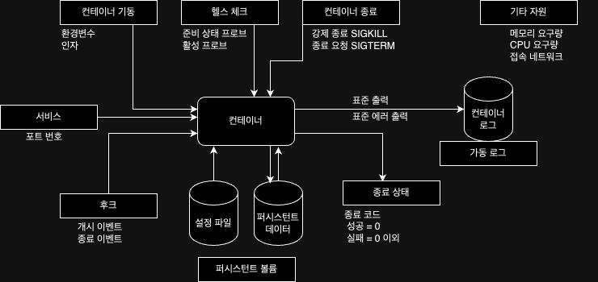

컨테이너 API는 컨테이너를 블랙박스처럼 다룰 수 있게 해주는 인터페이스다.
이는 쿠버네티스 환경에서도 사용된다.

# 컨테이너 API의 종류와 개요



## 컨테이너 기동

컨테이너 내의 애플리케이션은 기동 시에 환경 변수나 실행 인자를 읽어서 그에 맞게 동작하게 만들 수 있다.
예:) `docker run -d --name php -p 8080:80 -e MYSQL_USER=root -e MYSQL_PASSWORD=qwerty php-apl:01`

## 헬스 체크(쿠버네티스 환경)

### 준비 완료 프로브

컨테이너의 애플리케이션이 초기화가 완료되어 외부로부터 요청을 받을 수 있게 되었음을 알리는 인터페이스.
로드밸런서가 컨테이너에 요청을 전달하기 시작해도 될지 확인하기 위한 목적으로 사용

### 활성 프로브

애플리케이션의 기동 상태(정상/비정상)를 알리는 인터페이스.
이를 통해 비정상이 감지되면 쿠버네티스가 컨테이너를 재기동하여 복구를 시도한다.

## 컨테이너 종료

컨테이너 내의 애플리케이션은 종료 요청 시그널(SIGTERM)에 대한 종료 처리를 구현하는 것이 좋다.
여기서 말하는 종료 처리란 메모리의 값을 보존하거나 데이터베이스와의 세션을 종료한 뒤 정상 종료하는 것을 말한다.

강제 종료 시그널(SIGKILL)은 제한 시간 내에 종료 처리가 완료되지 않은 경웅 컨테이너를 강제 종료 하기 위해 사용된다.
애플리케이션이 강제 종료를 막을 수 있는 방법은 없다.

## 서비스

컨테이너 위에서 돌아가는 서버 애플리케이션은 특정 포트를 통해 클라이언트로부터의 요청을 받아들이고 처리 결과를 반환하는 역할을 수행한다.

이를 위해서는 컨테이너의 포트를 호스트의 IP 주소에 포트포워딩을 하여 외부에서의 요청을 받아들여야 한다.

## 로그

도커나 쿠버네티스에서는 로그를 일관되게 관리하여 컨테이너의 표준 출력(STDOUT)과 표준 오류(STDERR)를 로그로 간직한다.

따라서 컨테이너의 애플리케이션은 로그를 파일에 쓰는 것이 아니라 표준 출력이나 표준 오류에 쓰면 된다.

도커 허브에 등록된 Nginx의 경우는 엑세스 로그를 표준 출력에 출력한다.

## 후크(쿠버네티스 환경)

컨테이너가 기동하고 종료할 때 컨테이너 내에서 특정 처리를 실행시킬 수 있다.
쿠버네티스에서는 파드의 매니페스트에 실행 내용을 기술할 수 있다.

컨테이너에는 후크에 의해 실행될 스크립트, 혹은 HTTP 요청 처리를 구현해야 한다.
이때 Dockerfile의 ENTRYPOINT나 CMD로 지정한 명령어와 후크를 비동기적으로 실행되어 실행 순서가 보장되지 않는다.

## 퍼시스턴트 볼륨

컨테이너에서 퍼시스턴트 볼륨을 사용하는 대표적인 경우는 설정 파일을 외부에서 주입하는 경우와 발생하는 데이터를 보존하는 경우 두 가지가 있다.
두 경우 다 호스트의 디렉터리를 컨테이너의 파일 시스템에 마운트하여 사용한다.

전자의 경우, 애플리케이션이 읽어 들일 설정 파일을 컨테이너 외부에서 주입한다.
설정 파일을 바꾸기 위해 이미지를 다시 빌드하지 않아도 되어 컨테이너의 재사용성이 높아진다.
주입 방법은 설정 파일을 담은 디렉터리를 컨테이너의 특정 디렉터리에 마운트하면 된다.

인증서와 같이 보안에 민감은 파일 또한 이미지에 담아 레포지터리에 등록하면 안된다.
이 경우도 퍼시스턴트 볼륨을 사용하여 외부에서 컨테이너에 주입해야 한다.

쿠버네티스에는 보안에 민감한 데이터를 다루기 위한 시크릿과 일반적인 설정 파일을 다루는 컨피그맵이 있다.

## 종료 상태

PID가 1인 프로세스의 Exit 코드가 컨테이너의 종료 코드로 설정된다.
쿠버네티스에서는 컨테이너가 종료 코드 0으로 종료하면 정상 종료로 취급하고, 그 외의 값인 경우에는 비정상 종료로 취급한다.
컨테이너 상의 애플리케이션은 적절하게 종료 코드를 반환하도록 구현해야 한다.

## 그 외

접속 네트워크는 컨테이너 간 연동을 위해 존재한다.
예를 들어, 한 컨테이너가 데이터베이스 컨테이너를 필요로 하는 경우엔 같은 네트워크에 묶으면 된다.

메모리 요구량이나 CPU 요구 시간의 경우에는 컨테이너 실행 전에 필요한 크기를 예측하여 설정하면 쿠버네티스가 스케줄링을 효과적으로 수행하여 문제를 미연에 방지할 수 있다.

# 환경 변수 API 구현 예

```docker
FROM alpine:latest
RUN apk update && apk add bash
ADD ./my_deamon /my_deamon
CMD ["/bin/bash", "/my_deamon"]
```

```bash
# 카운터 초기화
COUNT=0

# 환경 변수가 없으면 설정
if [ -z "$INTERVAL" ]; then
  INTERVAL=3
fi

# 메인 루프
while [ ture ];
do
  TM=`date|awk '{print $4}'`
  printf " %s : $s \n" $TM $COUNT
  let COUNT=COUNT+1
  sleep $INTERVAL
done
```

`docker build --tag my_daemon:0.1 .`

`docker run --name myd my_daemon:0.1`

`docker run --name myd -e INTERVAL=1  my_daemon:0.1`
