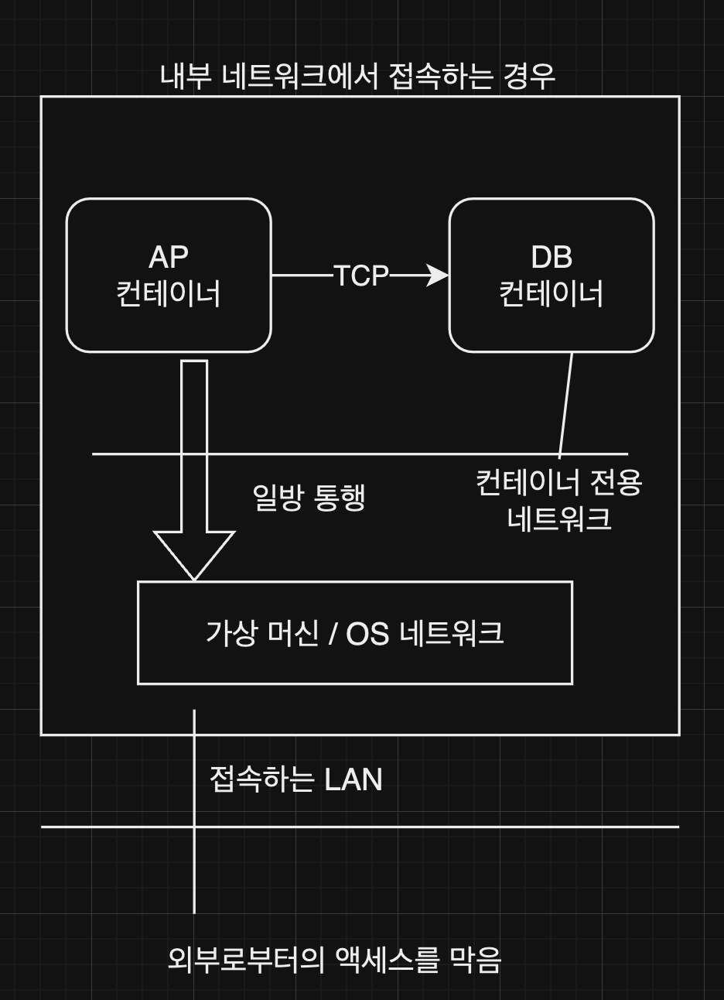
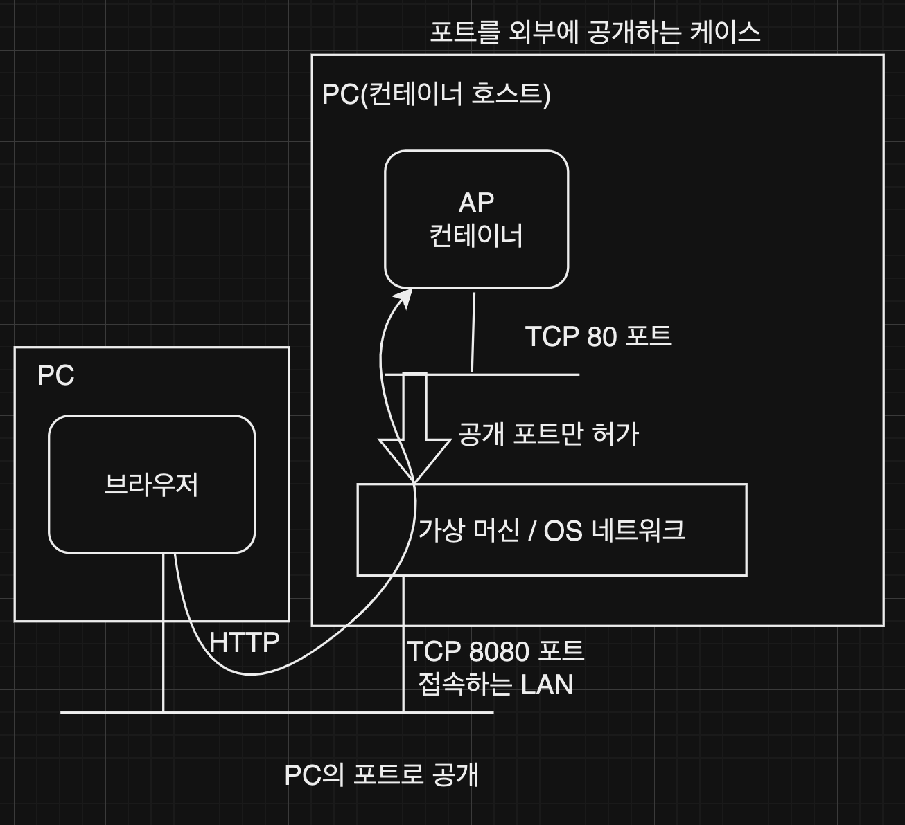
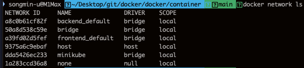
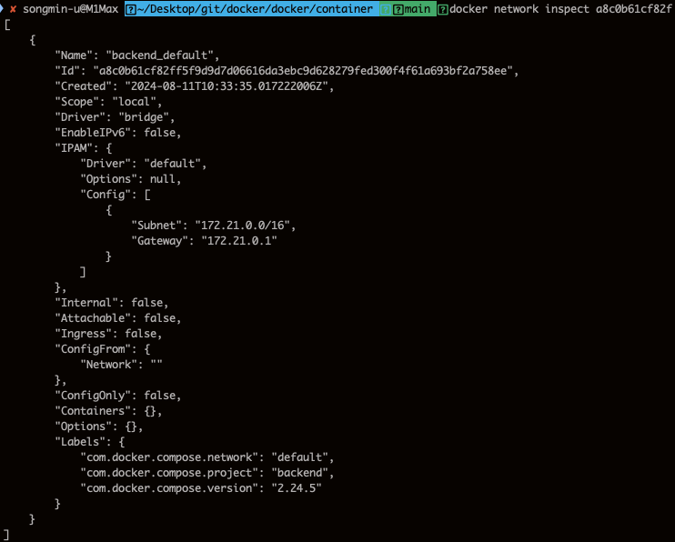
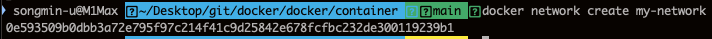

# 컨테이너와 네트워크

실행 중인 컨테이너는 IP 주소를 할당받아 컨테이너 간 통신이 가능하다.
호스트 내에서 접근 가능한 전용 네트워크를 통해 애플리케이션과 데이터베이스를 연결하는 것이 가능하다.
또한, 컨테이너를 호스트의 외부 네트워크에 공개하는 것도 가능하다.

# 컨테이너 네트워크

docker의 서브 커맨드 network를 사용하면 컨테이너 네트워크를 만들거나 지울 수 있다.

| 컨테이너 네트워크 커맨드  | 설명                                      |
| ------------------------- | ----------------------------------------- |
| docker network ls         | 컨테이너 네트워크를 리스트로 표시         |
| docker network inspect    | 네트워크 명을 지정해서 자세한 내용을 표시 |
| docker network create     | 컨테이너 네트워크를 생성                  |
| docker network rm         | 컨테이너 네트워크를 삭제                  |
| docker network connect    | 컨테이너를 컨테이너 네트워크에 접속       |
| docker network disconnect | 컨테이너를 컨테이너 네트워크에서 분리     |

## docker network ls

DRIVER열에서 bridge인 경우는 외부 네트워크와 연결되어 있는 네트워크이다.
이 네트워크에 연결된 컨테이너는 외부의 리포지터리에 접근할 수 있으며 `-p` 옵션으로 외부에 포트를 공개할 수도 있다.
컨테이너를 가동할 때 명시적으로 네트워크를 지정하지 않으면 이 네트워크에 연결된다.

## docker network inspect [network id]

## docker network create [network name]

`docker run --network [network name]` 로 컨테이터를 기동하면 network name에 연결된 컨테이너가 기동된다.
이렇게 기동된 컨테이너는 같은 네트워크에 연결된 컨테이너와만 통신이 가능하다.

`docker run -d --name webserver1 --network my-network nginx:latest`
