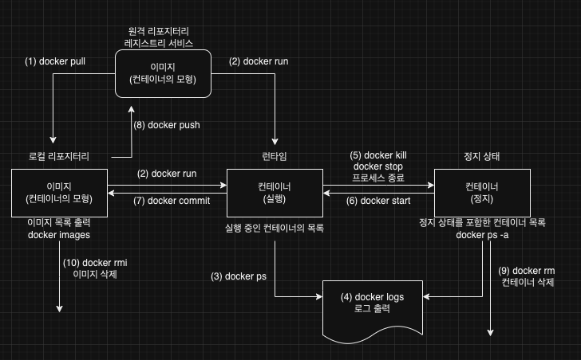

# 컨테이너의 생명 주기와 도커 커맨드


컨테이너는 세 가지 상태를 가진다. 위 그림은 컨테이너의 사 가지 상태와 도커 커맨드와의 관계를 나타낸다. 커맨드에 따라 컨테이너의 상태가 어떻게 변화하는지 알 수 있다.

- 이미지 : 컨테이너의 모형이 되는 것으로 실행되기 전의 상태
- 실행 : 컨테이너 위에서 프로세스가 실행 중인 상태
- 정지 : 프로세스의 종료 코드, 로그가 보존된 채 정지한 상태

## (1) 이미지 다운로드(docker pull)

명령어 `docker pull 피로지터리명[:태그]`를 실행하면 원격의 리포지터리로부터 이미지를 다운로드(pull) 한다.

`docker pull centos:7`

## (2) 컨테이너 실행(docker run)

명령어 `docker run [옵션] 리포지터리명:태그 [커맨드] [인자]`는 지정한 이미지를 모형으로 컨테이너를 가동한다.

만약 로컬에 없다면 원격 리포지터리에서 이미지를 다운로드하고 컨테이너를 실행한다.

기본값으로 설정된 원격의 리포지터리는 도커 허브(Docker Hub)지만, 클라우드에서 제공하는 프라이빗 레지스트리 서비스를 사용할 수도 있다.

`docker run -it --name test1 centos:7 bash` -> 컨테이너를 기동하여 대화형 셸을 실행

### 자주 사용하는 docker run 옵션

| 옵션   | 설명                                                                                                              |
| ------ | ----------------------------------------------------------------------------------------------------------------- |
| -i     | 키보드 입력을 컨테이너의 표준 입력에 연결하여 키보드 입력을 컨테이너의 셸 등에 보낸다.                            |
| -t     | 터미널을 통해 대화형 조작이 가능하게 한다.                                                                        |
| -d     | 백그라운드로 컨테이너를 돌려 터미널과 연결하지 않는다.                                                            |
| --name | 컨테이너에 이름을 설정한다. 시스템에서 유일한 이름이어야 하며, 옵션을 생략하면 자동으로 만들어진 이름이 부여된다. |
| --rm   | 컨테이너가 종료하면 종료 상태의 컨테이너를 자동으로 삭제한다.                                                     |

## (3) 컨테이너의 상태 출력(docker ps)

`docker ps [옵션]`은 실행 중이거나 정지 상태에 있는 컨테이너 목록을 출력한다.

옵션 생략 시 실행중인 컨테이너만 출력하면 `-a` 옵션을 추가하면 정지 상태의 컨테이너도 출력된다.

## (4) 로그 출력(docker logs)

정지 상태인 컨테이너는 삭제될 때까지 남아 있으며, 실행 중 발생한 표준 출력과 표준 에러 출력을 간직하고 있다.

명령어 `docker logs [옵션] 컨테이너ID | 컨테이너명`를 통해 확인할 수 있다.

`-f` 옵션을 사용하면 컨테이너가 실행 중인 상태에서 실시간으로 발생하는 로그를 볼 수 있다.

## (5) 컨테이너 정지(docker stop, docker kill)

실행중인 컨테이너를 저잊시키는 방법은 다음과 같이 세 가지가 있다.

1. 컨테이너의 PID=1인 프로세스가 종료한다.
2. `docker stop 컨테이너ID | 컨테이너명`을 실행한다.
3. `docker kill 컨테이너ID | 컨테이너명`을 실행한다.

`docker run centos:7` 이렇게 별다른 커맨드 지정없이 실행하면 실행하자마자 종료된다. 이것은 PID=1인 쎌이 종료했기 때문이다.

`docker kill` 커맨드는 컨테이너 안의 PID=1인 프로세스를 강제 종료한다. 따라서 `docker stop`을 사용할 수 없는 비정상적은 상황에서만 사용하는 것이 바람직하다.

## (6) 컨테이너 재기동(docker start)

정지 상태의 컨테이너는 `docker start [옵션] 컨테이너ID | 컨테이너명`으로 재기동할 수 있다.

## (7) 컨테이너의 변경 사항을 리포지터리에 저장(docker commit)

`docker commit [옵션] 컨테이너ID | 컨테이너명 리포지터리명[:태그]`를 실행하면 현재 컨테이너의 상태를 이미지로 만들어 리포지터리에 보관할 수 있다.

```
# centos 실행
docker run -it centos:7 bash

# yum update
yum update -y

# git install
yum install -y git

# 종료
exit

# 컨테이너를 이미지로 생성
docker commit 6ae57279697a centos:7-git
```

## (8) 이미지를 원격 리포지터리에 보관(docker push)

이미지를 원격 리포지터리에 등록하는 것은 쿠버네티스에서 컨테이너를 돌리기 위해 반드시 해야 하는 작업이다.
