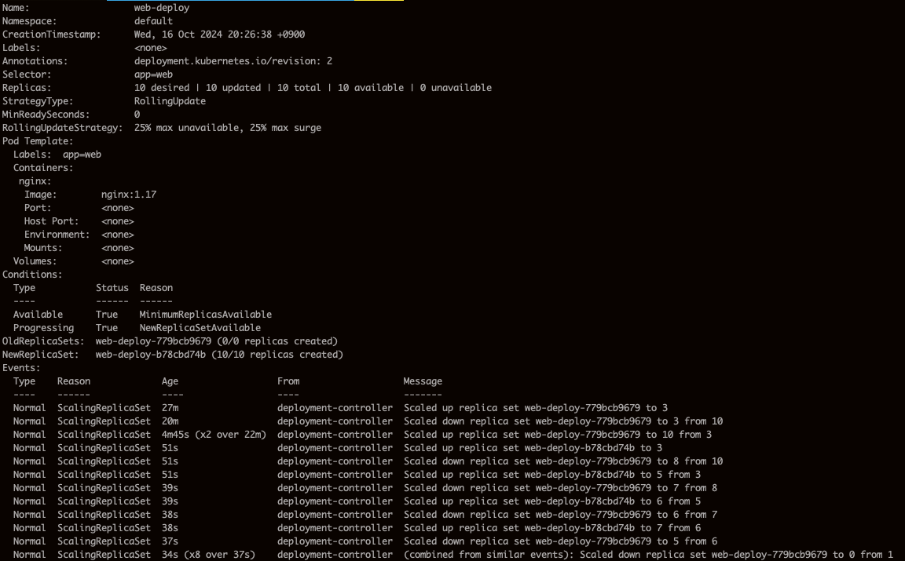

# 디플로이먼트의 역할 이해하기

- 백엔드의 워크로드에 적합하다.
- 주된 역할은 파드의 개수를 관리하는 것이다.
- 요청한 개수만큼 파드를 가동하여, 장애 등의 이유로 파드의 개수가 줄어들면 새롭게 파드를 만들어 기동한다.
- 애플리케이션의 버전을 업그레이드할 때 새로운 버전의 파드로 조금씩 바꾸는 기능도 제공한다.
- 혼자 동작하지 않고 레플리카셋과 함께 동작한다.
- 레플리카셋은 디플로이먼트의 매니페스트에 작성된 레플리카의 값을 기준으로 파드의 개수를 제어한다.

# 디플로이먼트의 생성과 삭제

`kubectl apply -f yaml_file_name`

`kubectl delete -f yaml_file_name`

```yaml
apiVersion: apps/v1
kind: Deployment
metadata:
  name: web-deploy
spec: # 디플로이먼트 사양
  replicas: 3 # 생성하고 유지할 파드의 개수
  selector:
    matchLabels: # 컨트롤러와 파드를 대응시키는 라벨
      app: web # 파드에 해당 라벨이 있어야 한다.
  template: # 파드 템플릿
    metadata:
      labels:
        app: web # 파드의 라벨, 컨트롤러의 matchLabels와 일치해야함
    spec: # 컨테이너 사양
      containers:
        - name: nginx
          image: nginx:1.16
```

## 디플로이먼트 사양(Deploymentspec v1 apps)

| 주요 항목 | 설명                                                                                                                                                                                                                                           |
| --------- | ---------------------------------------------------------------------------------------------------------------------------------------------------------------------------------------------------------------------------------------------- |
| replicas  | 파드 템플릿을 사용하여 기동할 파드의 개수를 지정한다. 디플로이먼트는 이 값을 유지하도록 동작한다. 예를 들어, 보수 작업을 위해 노드를 정지시키는 경우, 남아 있는 노드에 파드를 기동해서 기동하는 파드의 개수가 replicas 값과 일치하도록 만든다. |
| selector  | 디플로이먼트 제어하의 레플리카셋과 파드를 대응시키기 위해 matchLabels의 라벨이 사용된다. 이 라벨이 파드 템플릿의 레이블과 일치하지 않으면, kubectl create/apply 시에 에러가 발생한다.                                                          |
| template  | 주요 항목으록 metadata, containers가 있다. metadatas: 상기의 실렉터가 지정하는 라벨과 일치해야 한다. containers: 파드 컨테이너의 사양                                                                                                          |

디플로이먼트의 템플릿은 디플로이먼트에 의해 기동될 파드의 템플릿을 의미한다.

# 스케일 기능

레플리카의 값을 변경하여 파드의 개수를 조절하여 처리 능력을 높이거나 낮추는 기능이다.
수동으로 할 수도 있고, CPU 사용률과 연동하여 동적으로 레플리카의 값을 조절하는 오토스케일 기능도 있다.

수동으로 하는 방법은 yaml의 replicas 값을 변경 후 `kubectl apply -f yaml_name`을 입력하면 된다.

디플로이먼트를 통해 늘릴 수 있는 것은 파드의 개수뿐이다.
파드의 개수를 늘리는 중에 쿠버네티스 클러스터의 자원(CPU와 메모리)이 부족해지면 노드를 추가하여 자원이 생길 때까지 파드 생성이 보류된다.
메모리가 부족한 상황에서 리눅스의 가상 메모리를 사용하여 메인 메모리를 페이징하면서까지 파드를 늘려주지 않는다.
메인 메모리로 파드를 배치할 수 없으면 파드는 생성되지 않는다.
따라서 파드의 개수를 늘리기 전에 클러스터의 가용 자원을 확인하여 노드의 증설을 검토할 필요가 있다.

# 롤아웃 기능

쿠버네티스에서의 롤아웃은 컨테이너의 업데이트를 의미한다.
롤아웃을 하기 위해서는 사전에 새로운 이미지를 빌드하고, 리포지터리에 등록해 놓아야 한다.
그리고 새로운 이미지를 매니페스트의 image 항목에 기재하고 적용하면 된다.

롤아웃을 하는 중에도 사용자의 요청을 처리할 수 있도록 정해진 개수만큼 업데이트를 진행할 수 있다.
하지만 새로운 버전과 이전 버전의 컨테이너가 동시에 돌아가는 것이 가능하려면 롤아웃 기능만으로는 충분치 않다.
애플리케이션의 설계, 테이블 설계, 캐시 이용 등을 함께 고려해야 한다.
애플리케이션을 잘 설계하여 쿠버네티스의 롤아웃 기능을 활용한다면 무척 편리하게 서비스를 운영할 수 있다.

```yaml
apiVersion: apps/v1
kind: Deployment
metadata:
  name: web-deploy
spec:
  replicas: 10
  selector:
    matchLabels:
      app: web
  template:
    metadata:
      labels:
        app: web
    spec:
      containers:
        - name: nginx
          image: nginx:1.17
```

버전을 1.16에서 1.17로 변경 후 `kubectl apply -f yaml_name` 실행

그후 `kubectl describe deployment web-deploy` 입력



롤아웃에 의해 종료되는 파드에는 종료 요청 시그널 SIGTERM이 전송된다.
만약 컨테이너에서 애플리케이션이 이 시그널을 받아서 종료 처리를 하지 않으면 30초 후에 SIGKILL에 의해 강제 종료 된다.
