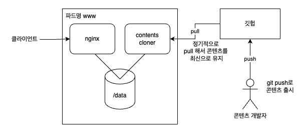

# 사이트카 패턴

하나의 파드 안에 여러개의 컨테이너를 담아서 실행시키는 패턴이다.
이는 파드(완드콩)라는 이름의 유래가 되는 기능이기도 하다.



사이드카 패턴의 장점은 여러 개의 컨테이너를 조합하여 사용함으로써 컨테이너의 재사용성이 높아지고, 생산성이 높아진다는 점이다.
매번 필요에 맞는 컨테이너를 만드는 것이 아니라 전에 만든 컨테이너를 재활용할 수 있어 단기간에 커다란 성과를 얻을 수 있다.

```bash
#!/bin/bash
# 최신 Web 데이터를 GitHub로부터 취득

# 환경변수가 설정되어 있지 않으면 에러 종료
if [ -z $CONTENTS_SOURCE_URL ]; then
   exit 1
fi

# 처음에는 GitHub에서 클론
git clone $CONTENTS_SOURCE_URL /data

# 이후에는 1준 간격으로 git pull을 수행
cd /data
while true
do
   date
   sleep 60
   git pull
done
```

contents-cloner의 기능을 담당하는 쉘 스크립트.
CONTENTS_SOURCE_URL 을 통해 60마다 갱신 여부를 확인하고 다운로드한다.
처음에는 clone 후 60초 마다 pull 한다.

```docker
## Contents Cloner Image
FROM ubuntu:16.04
RUN apt-get update && apt-get install -y git
COPY ./contents-cloner /contents-cloner
RUN chmod a+x /contents-cloner
WORKDIR /
CMD ["/contents-cloner"]
```

`docker build --tag c-cloner:0.1 .`

```yaml
## 사이드카 파드 예제
#
apiVersion: v1
kind: Pod
metadata:
  name: webserver
spec:
  containers: ## 메인 컨테이너
    - name: nginx
      image: nginx
      volumeMounts:
        - mountPath: /usr/share/nginx/html
          name: contents-vol
          readOnly: true

    - name: cloner ## 사이드카 컨테이너
      image: maho/c-cloner:0.1
      env:
        - name: CONTENTS_SOURCE_URL
          value: 'https://github.com/takara9/web-contents'
      volumeMounts:
        - mountPath: /data
          name: contents-vol

  volumes: ## 공유 볼륨
    - name: contents-vol
      emptyDir: {}
```

`kubectl apply -f webserver.yml`
